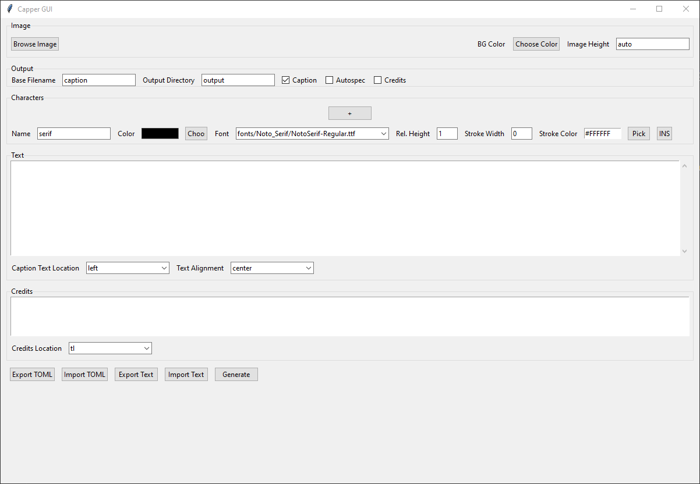

# Capper GUI
A lazily built GUI for [Capper](https://github.com/substantialpickle/Capper)

## How to Use
Go to [releases](https://github.com/synchroslap/CapperGUI/releases). Download the zip file and extract it.
Open gui.exe if you're on Windows. 

If you don't trust random executables from strangers on the internet,
or you're on a different OS, you can also run it by running `python gui.py` in your shell.
Just remember to run `pip install -r requirements.txt` if you're going to run the python file directly.

Read the original README for Capper if you actually want a detailed understanding of how Capper works.
You can also read the Capper [specification guide](https://github.com/substantialpickle/Capper/wiki/Specification-Guide)
if you want to know exactly what each setting does.

Otherwise, read below for a quick overview.
### Image
- Select an image file for your caption by clicking "Browse Image".
- Pick a background color for your text section with the "Choose Color" button.
- You can also adjust image height if your caption image isn't properly scaled in the output. It should be fine on auto though.

### Output
- Base Filename is the prefix that all the files generated by Capper will have
- Output Directory is the name of the folder inside the CapperGUI folder where your output will be saved. 
**Make sure this folder exists/you create this folder before you generate your caption or it will error out.**
- Leave "Caption" checkbox checked if you actually want this to generate a caption
- If you check "Autospec" Capper will generate an autospec.toml file with all the settings for the generated caption inside
- Enabling "Credits" will generate an image solely consisting of the credits

### Characters
"Characters" are basically where you define the font styles you want to use. 
- "Name" is what you will use to denote which sections of the text will use your character text settings
- "Color" is the color for the text
- "Font" is a dropdown menu containing every .ttf font file in your "fonts" subfolder. 
Just throw your .tff files in there however you want and it should show up.
- "Rel. Height" is the scale multiplier you can use to adjust the font size of the character.
- "Stroke Width" and "Stroke Color" determine the thickness and color of a stroke outline around your text.
Keep "Stroke Width" at 0 if you don't want any.
- Click the "+" button to add more characters/font settings.

### Text
Enter the text for your caption here. 
Use the character name inside square brackets \[\] to switch between text styles.
You can also use the "INS" button by the character to automatically insert this bracket 
label at the location of your cursor in the text box.

"Caption Text Location" defines where your caption text box will be on the final caption image.
Use split if you want it to be split across both sides.

"Text Alignment" is basically how you want your text to be justified.

### Credits
Entirely optional, if you don't want to use it, just leave it blank.
For "Credits Location", tl = top left, tr = top right, bl = bottom left, br = bottom right.

### Buttons
Export TOML will prompt you to save a TOML file with your current settings.
You can use this if you want to save your settings or want to modify your current 
settings with the optional specifications I haven't implemented in the GUI.

Import TOML will let you load back your TOML file settings. 
Basically everything except for the actual caption text itself.

Generate creates the caption

## Dev Setup
Currently setup for Windows dev environment.

Install python requirements with

`pip install -r requirements.txt`

For build process you will need to install
- [Cmake](https://cmake.org/download/)
- cx_Freeze with `pip install cx_Freeze`
- [7-zip](https://7-zip.org/)

Make sure that you add your 7-zip install directory (usually C:\Program Files\7-Zip), 
and Cmake (usually C:\Program Files\CMake\bin) to your PATH environment variable.

Run `make` to generate exe and release zip file.

Run `make build` to only generate exe in build/dist

Run `make clean` to delete release and build folder contents

Run `make zip` to zip the contents of the release folder